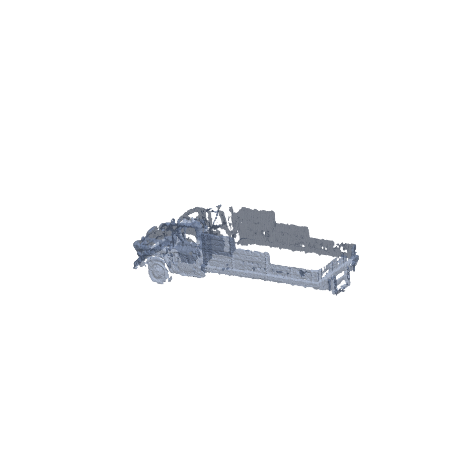
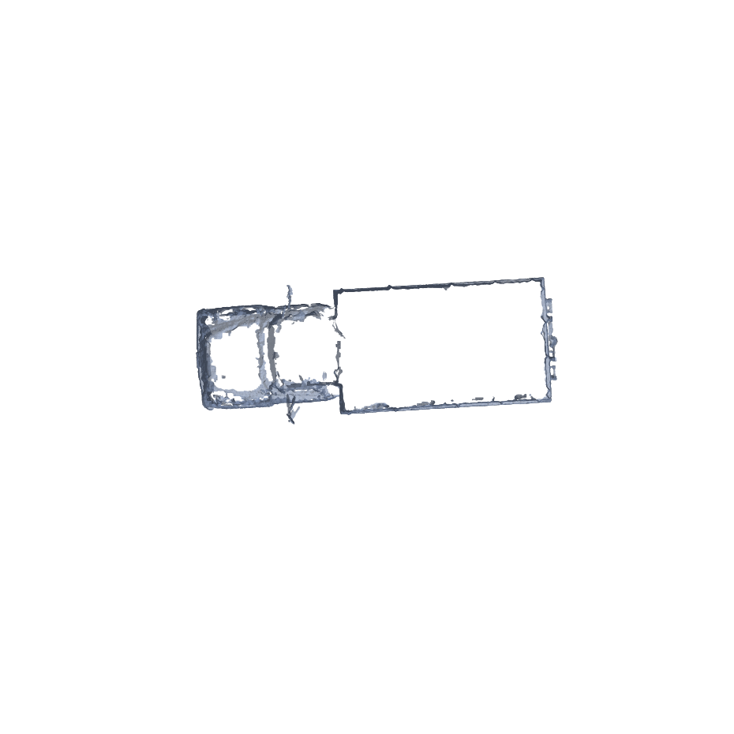
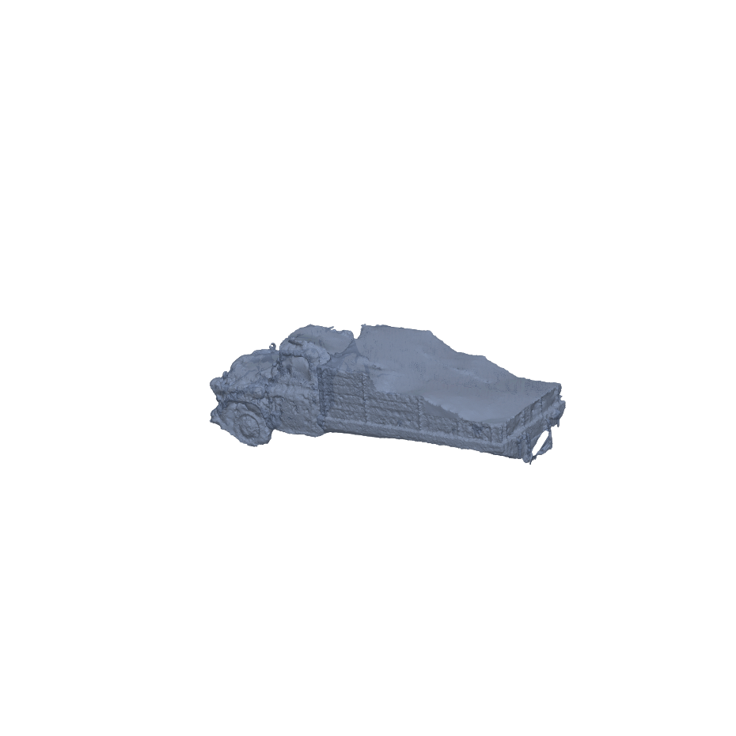

# Gruppe 7 — Objektrekonstruktion (Neural Rendering, VLM)

Kursprojekt, FH Technikum Wien. Ziel: aus 5–30 Fotos eines Objekts automatisch ein
3D-Modell (STL) rekonstruieren — mit 3D Gaussian Splatting (nerfstudio/splatfacto) und
sprachgesteuerter Segmentierung (Grounding DINO + SAM2), damit nur das benannte Objekt
(z. B. "the toy truck") im Mesh landet, nicht der Hintergrund.

Vollständiger Projektstatus, Architektur, Testergebnisse und offene Punkte:
siehe **[PROJECT_STATUS.md](PROJECT_STATUS.md)**.

## Anforderungs-Checkliste

Abgleich mit den Punkten der Aufgabenstellung — was umgesetzt ist und wo genau:

| # | Anforderung | Status | Umsetzung |
|---|---|---|---|
| 1 | 3D-Rekonstruktion aus Fotos | ✅ fertig | `ns-train splatfacto` (3D Gaussian Splatting), [`pipeline_clean.ipynb`](pipeline_clean.ipynb) Abschnitt 5 · Details: [PROJECT_STATUS.md §1](PROJECT_STATUS.md#1-status-nach-punkten-der-aufgabenstellung), [§3](PROJECT_STATUS.md#3-was-technisch-umgesetzt-wurde) |
| 2 | Sprachgesteuerte Segmentierung (Text → nur das genannte Objekt) | ✅ fertig | Grounding DINO + **SAM2**, 251/251 Masken erzeugt, [`pipeline_clean.ipynb`](pipeline_clean.ipynb) Abschnitt 4 |
| 3 | Masken vor/während dem Training angewendet (Hintergrund wird nie trainiert) | ✅ fertig | `ns-train ... --masks-path masks`, [`pipeline_clean.ipynb`](pipeline_clean.ipynb) Abschnitt 5 |
| 4 | Export als STL | ✅ fertig | Gaussians → Poisson-Mesh → STL, [`pipeline_clean.ipynb`](pipeline_clean.ipynb) Abschnitt 8 · Ergebnis: [`truck_object_30k.stl`](truck_object_30k.stl) |
| 5 | (optional, ~10 %) Evaluierung vs. CAD-Referenz (Chamfer-Distanz) | ⚠️ Proxy fertig, **echte CAD-Variante vorbereitet** | Self-Consistency-Proxy: siehe [unten](#evaluierung); echte externe CAD-Evaluierung (ABO-Datensatz) als Notebook-Abschnitt 9b vorbereitet, noch nicht auf Colab ausgeführt — siehe [PROJECT_STATUS.md §8](PROJECT_STATUS.md#8-was-noch-zu-tun-bzw-zu-prüfen-ist), Punkt 2 |
| — | Zielszenario: 5–30 Fotos (statt Testdatensatz mit 251) | ✅ getestet (truck-Teilmengen) + ⚠️ **echter Fototest vorbereitet** | Sparse-View-Test bei n=12/20/24/30 (truck), siehe [PROJECT_STATUS.md §4](PROJECT_STATUS.md#4-sparse-view-test-funktioniert-die-pipeline-mit-530-fotos); echter (nicht Teilmengen-)Test mit realen Fotos eines anderen Objekts als Notebook-Abschnitt 9 vorbereitet, siehe [PROJECT_STATUS.md §8](PROJECT_STATUS.md#8-was-noch-zu-tun-bzw-zu-prüfen-ist), Punkt 1 |
| — | STL druckbar (watertight) | ✅ fertig | `truck_object_30k.stl` lokal mit `pymeshfix` repariert → [`truck_object_30k_watertight.stl`](truck_object_30k_watertight.stl), siehe [PROJECT_STATUS.md §8](PROJECT_STATUS.md#8-was-noch-zu-tun-bzw-zu-prüfen-ist), Punkt 4 |

Methodenvorgabe eingehalten: ausschließlich 3D Gaussian Splatting, kein NeRF, kein
Methodenvergleich.

## Ergebnis (Visualisierung)

| Isometrisch | Draufsicht | Watertight-Version |
|---|---|---|
|  |  |  |

Erste beide gerendert aus [`truck_object_30k.stl`](truck_object_30k.stl) (342 342 Dreiecke,
30 000 Trainingsiterationen, nach Hintergrund-Maskierung + DBSCAN-Ausreißerfilterung).
Dritte Ansicht aus der lokal mit `pymeshfix` reparierten, **druckbaren (watertight)**
Version [`truck_object_30k_watertight.stl`](truck_object_30k_watertight.stl)
(560 156 Dreiecke).

> **Fehlt noch:** ein Vorher/Nachher-Vergleich mit 1–2 Original-Fotos aus dem
> `truck`-Datensatz und der zugehörigen SAM2-Segmentierungsmaske. Diese liegen nur auf
> Colab/Google Drive (`/content/tandt/truck/images`, `/content/tandt/truck/masks`) — hier
> lokal nicht vorhanden. Zum Ergänzen: aus Colab je ein Originalbild und die passende
> `masks/<gleicher-name>.png`-Datei herunterladen und unter `docs/images/` ablegen
> (z. B. `photo_original.jpg`, `photo_mask.png`), dann sage Bescheid — ich baue sie ins
> README ein.

## Evaluierung

Die Aufgabenstellung sieht optional (~10 % der Bewertung) einen Vergleich der
rekonstruierten STL-Geometrie mit einem **externen CAD-Referenzmodell** (Chamfer-Distanz)
vor. Dafür war kein passendes physisches Objekt mit auffindbarem CAD-Modell verfügbar.

**Stattdessen umgesetzt: Selbstkonsistenz-Test (Proxy, kein CAD-Vergleich).** Die volle
251-Foto-Rekonstruktion dient als Pseudo-Referenz; eine Sparse-Rekonstruktion aus 30
Fotos (22 registrierte Bilder) wird nach Ausrichtung (Normalisierung + Rotationssuche +
ICP) dagegen verglichen. Ergebnis: ICP-Inlier-RMSE 0,0263, bidirektionale
Chamfer-Distanz 0,2497 (beide auf Objektgröße normiert) — Grundform stimmt überein, aber
ein spürbarer Teil der Sparse-Geometrie weicht von der Referenz ab.

**Wichtig:** Das ist ausdrücklich **kein** Vergleich mit einem externen CAD-Modell, wie
im Aufgabentext gefordert, sondern ein selbst gewählter Ersatz-Ansatz, weil kein
Referenzobjekt verfügbar war. Diese Einschränkung sollte im Bericht/bei der Abgabe klar
benannt werden, statt die Proxy-Metrik als die geforderte CAD-Auswertung darzustellen.
Volle Methodik: [PROJECT_STATUS.md §5](PROJECT_STATUS.md#5-evaluierung-chamfer-distanz).

## Dateien

| Datei | Inhalt |
|---|---|
| [`pipeline_clean.ipynb`](pipeline_clean.ipynb) | Hauptnotebook der Pipeline (mit Zellausgaben aus dem letzten erfolgreichen Lauf) — Kameraposen (COLMAP) → 3DGS-Training (splatfacto) → SAM2-Maskierung → Mesh-Export (Poisson) → STL. Abschnitt 9: echter Fototest + CAD-Evaluierung (ABO-Datensatz). Abschnitt 10: Wiederholung des n=20-Sparse-Tests |
| [`pipeline.ipynb`](pipeline.ipynb) | Frühere Version des Notebooks |
| [`PROJECT_STATUS.md`](PROJECT_STATUS.md) | Ausführliches Übergabedokument: Status, Umgebung, Ergebnisse, Evaluierung |
| [`truck_object_30k.stl`](truck_object_30k.stl) | Exportiertes Beispiel-Mesh (Testobjekt "truck", 30k Trainingsiterationen), nicht watertight |
| [`truck_object_30k_watertight.stl`](truck_object_30k_watertight.stl) | Dieselbe Geometrie, lokal mit `pymeshfix` repariert — watertight, druckbar |
| [`truck_positions.json`](truck_positions.json) | Kameraposen-Daten des Testdatensatzes |
| [`docs/images/`](docs/images/) | Renderings des Ergebnis-Mesh für dieses README |
| [`paper/`](paper/) | Wissenschaftliche Ausarbeitung (IEEE-Template, 3 Seiten) — Fortschrittsbericht 1: Gliederung + ausformulierter Beitrag |

## Echter Fototest + externe CAD-Evaluierung (vorbereitet, wartet auf Colab-Ausführung)

Eigene Fotos eines Objekts waren nicht möglich. Stattdessen nutzt Notebook-Abschnitt 9
den öffentlichen Datensatz **[Amazon Berkeley Objects](https://amazon-berkeley-objects.s3.amazonaws.com/index.html)**
(CC BY 4.0, (c) Amazon.com) — **echte** Turntable-Fotos (72 Stück) eines realen Sessels
plus dessen **echtes CAD-Modell** (glTF). Damit lässt sich zum ersten Mal die vom
Aufgabentext geforderte Chamfer-Distanz gegen eine **externe** Referenz berechnen
(Abschnitt 9b), statt nur gegen die eigene dichte Rekonstruktion (Selbstvergleichs-Proxy,
[siehe unten](#evaluierung)). Getestet werden dense (72 Fotos), N=30 und N=20.

Claude kann Colab-Zellen nicht selbst ausführen — die Zellen sind vorbereitet und müssen
von der Nutzerin gestartet werden. Bei Veröffentlichung/Abgabe: Attribution an
Amazon.com angeben (CC BY 4.0, siehe Markdown-Zelle im Notebook).

## Ausführen

Das Notebook läuft auf **Google Colab** (GPU Tesla T4):

1. `pipeline_clean.ipynb` in Colab öffnen (z. B. über die VS-Code-Colab-Erweiterung oder
   direkt auf [colab.research.google.com](https://colab.research.google.com)).
2. Laufzeit mit GPU (T4) verbinden.
3. Zellen der Reihe nach ausführen — bereits erledigte Schritte überspringen sich selbst.

Details zur Umgebung (venv-Aufbau, Abhängigkeiten, bekannte Stolpersteine) stehen in
[PROJECT_STATUS.md](PROJECT_STATUS.md), Abschnitt 2.
